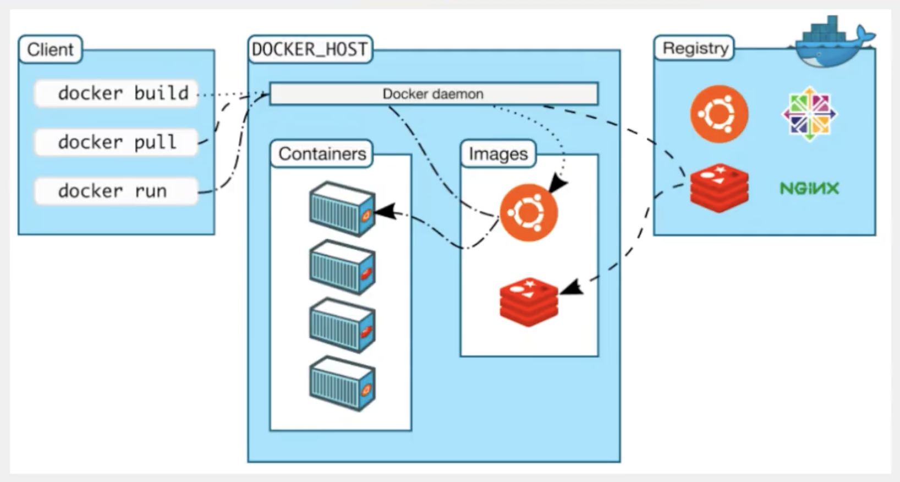
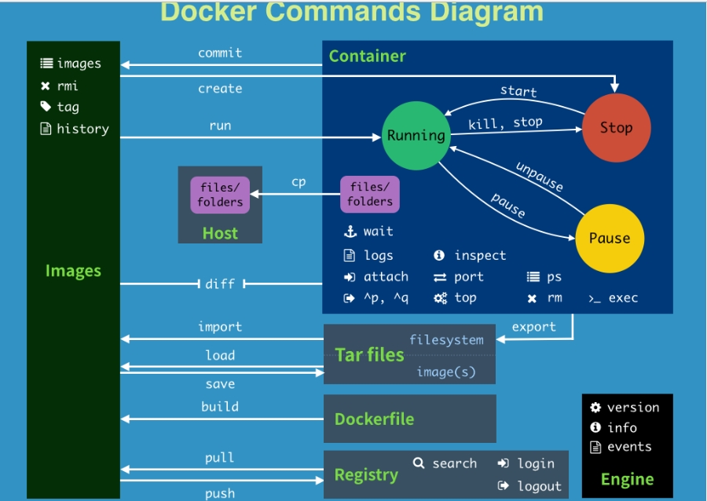
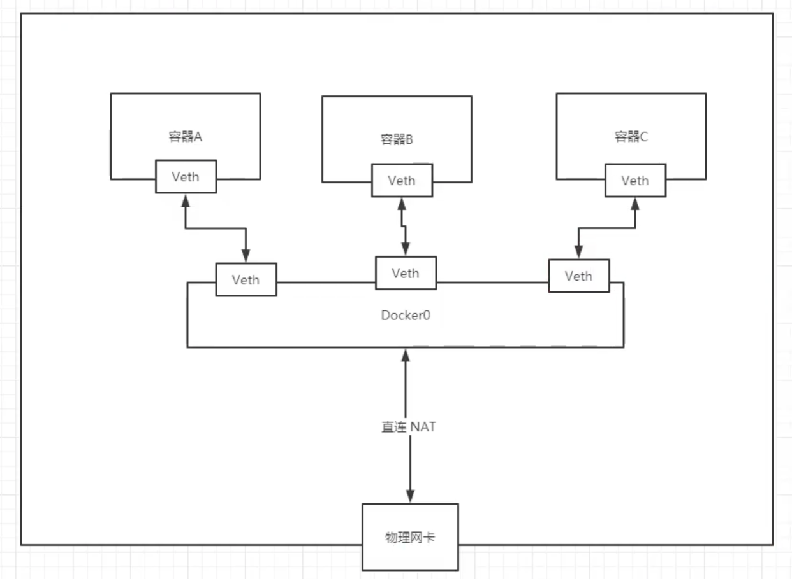

# Docker

## 基本结构



+ docker info
    + 预览容器配置
+ docker 架构图




## 镜像分层
共用的模块不用重复下载
每个镜像(基于linux)中总会有共有的部分

## 常用命令

```bash
# 列出所有镜像
docker images -a

# 删除所有镜像
docker rmi -f $(docker images -aq)

# 容器启动
docker run [image]
--name # 容器名字
-d     # 后台方式运行
-it    # 交互方式运行
-p     # 指定容器端口
-v     # 指定卷路径

# 删除所有容器
docker rm -f $(docker ps -aq)

# docker 容器后台运行时如果没有前台进程 就会自动停止
docker run -d zookeeper /bin/bash -c "while true;do echo hanwenhao;sleep 1;done"

# 端口暴露后端以name启动 这里指定端口21810
docker run -d --name zook01 -p 21810:2181 zookeeper

# 查看容器内部环境信息
docker inspect

# 进入当前容器(创建新进程)
docker exec

# 设置容器网络
docker network

# 指定卷 本地卷映射容器内部卷
docker run -v /home/local:/home/container image

# 用原有进程进入容器(没啥用)
# docker attach

```

## 可视化

1. portainer
```bash
# -v 挂载
docker run -d -p 8080:9000 \
--restart=always -v /var/run/docker.sock:/var/run/docker.sock \
--privileged=true portainer/portainer
```

2. Rancher


3. lazydocker
自用

## 文件系统

### UnionFS
联合文件系统
分层、轻量级

### 数据卷
1. 通过 -v 挂载
2. mysql 启动示例
```bash
docker run -p 3308:3306 --name mysql-slave \
-v /mydata/mysql-slave/log:/var/log/mysql \
-v /mydata/mysql-slave/data:/var/lib/mysql \
-v /mydata/mysql-slave/conf:/etc/mysql \
-e MYSQL_ROOT_PASSWORD=root  \
-d mysql:5.7
```
+ 不指定路径时用容器内部路径
+ 可以给卷指定名字如 `-v somename:/path`
+ Mac M1 进入 docker 卷
`docker run -it --privileged --pid=host debian nsenter -t 1 -m -u -n -i sh`

### 制作镜像
1. 用 docker commit 构建
2. DockerFile

## DockerFile

### 常用语法


```dockerfile
FROM
构建镜像基于哪个镜像

MAINTAINER
镜像维护者姓名或邮箱地址

RUN
构建镜像时运行的指令

CMD
运行容器时执行的shell环境

VOLUME
指定容器挂载点到宿主机自动生成的目录或其他容器

USER
为RUN、CMD、和 ENTRYPOINT 执行命令指定运行用户

WORKDIR
为 RUN、CMD、ENTRYPOINT、COPY 和 ADD 设置工作目录，就是切换目录

HEALTHCHECH
健康检查

ARG
构建时指定的一些参数

EXPOSE
声明容器的服务端口（仅仅是声明）

ENV
设置容器环境变量

ADD
拷贝文件或目录到容器中，如果是URL或压缩包便会自动下载或自动解压

COPY
拷贝文件或目录到容器中，跟ADD类似，但不具备自动下载或解压的功能

ENTRYPOINT
运行容器时执行的shell命令

```

## Docker 网络

### Docker0
+ Docker For Mac作为虚拟机存在 没有docker0路由器
+ Linux环境下通过桥接方式会给容器成对分配网卡
    + 通过evth-pair实现
    + docker0作为路由器宿主于主机
+ --link
    + 只是在容器内的host中绑定了ip
    + 不建议使用



+ --net bridge 启动时会默认设置
    + 自定义设置 `docker network create --driver bridge --subnet 192.168.0.0/16 --gateway 192.168.0.1 mynet`

+ 可以通过 connect 直接添加虚拟网卡打通网络
    + `docker network connect mynet tomcat01`


