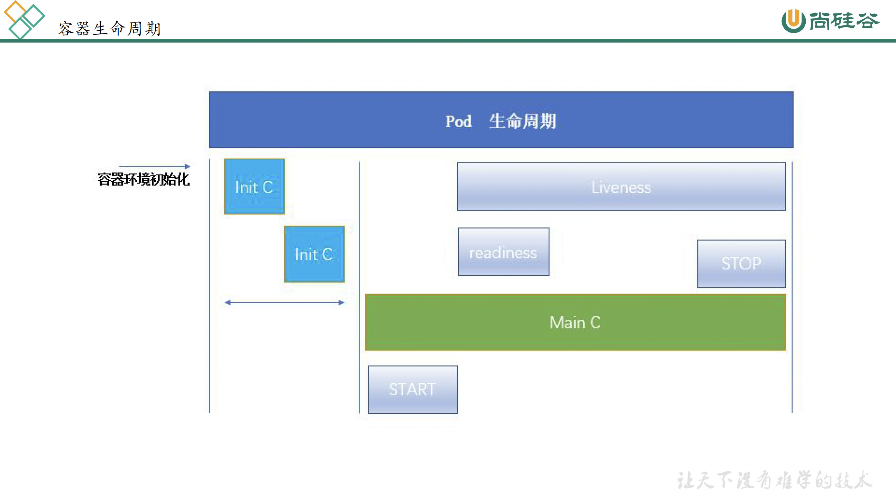
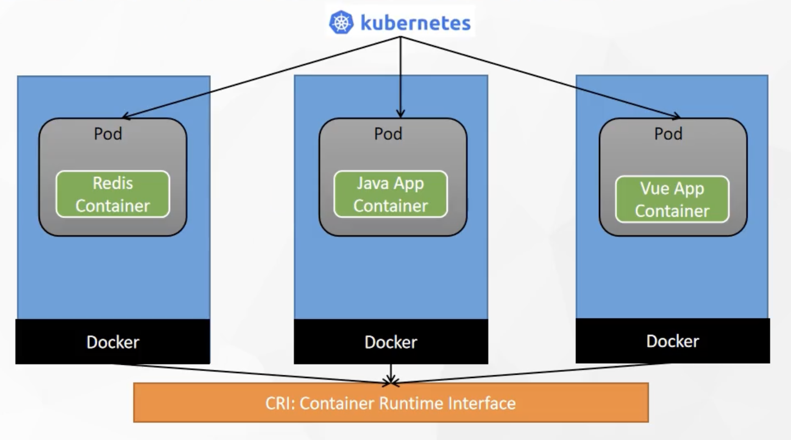

# Kubernetes

[中文文档](https://www.yuque.com/leifengyang/oncloud/ctiwgo#J03jA)

[视频导航](https://www.bilibili.com/video/BV1w4411y7Go)

## 基本结构


[配置自身的集群](https://blog.csdn.net/weixin_45054797/article/details/112159085)




## 集群搭建 TODO
+ 系统环境 Ubuntu 20 ARM 版
+ Docker 20.10.18
+ Kubeadm

### 初步设置(必需)
```bash
# 各个机器设置自己的主机名
hostnamectl set-hostname xxxx

# 将 SELinux 设置为 permissive 模式（相当于将其禁用）
# Ubuntu 默认没有 SELinux
#sudo setenforce 0
#sudo sed -i 's/^SELINUX=enforcing$/SELINUX=permissive/' /etc/selinux/config

# 关闭 swap
swapoff -a
sed -ri 's/.*swap.*/#&/' /etc/fstab


#确认并允许 iptables 检查桥接流量
lsmod | grep br_netfilter
cat <<EOF | sudo tee /etc/modules-load.d/k8s.conf
br_netfilter
EOF

cat <<EOF | sudo tee /etc/sysctl.d/k8s.conf
net.bridge.bridge-nf-call-ip6tables = 1
net.bridge.bridge-nf-call-iptables = 1
EOF
sudo sysctl --system

# 可能需要禁止自动挂起
sudo systemctl mask sleep.target suspend.target hibernate.target hybrid-sleep.target

```


### 在所有宿主机上安装 kubelet kubeadm kubectl
```bash
curl -s https://mirrors.aliyun.com/kubernetes/apt/doc/apt-key.gpg | sudo apt-key add -

sudo tee /etc/apt/sources.list.d/kubernetes.list <<EOF
deb https://mirrors.aliyun.com/kubernetes/apt/ kubernetes-xenial main
EOF

sudo apt-get update
sudo apt-get install kubelet kubeadm kubectl
sudo apt-mark hold kubelet kubeadm kubectl

```

### 所有宿主机获取并安装镜像列表
```bash
# 获取镜像与版本
kubeadm config images list

# 下面的镜像应该去除"k8s.gcr.io/"的前缀，版本换成上面获取到的版本
images=(
    kube-apiserver:v1.25.2
    kube-controller-manager:v1.25.2
    kube-scheduler:v1.25.2
    kube-proxy:v1.25.2
    pause:3.8
    etcd:3.5.4-0
    coredns/coredns:v1.9.3
)

for imageName in ${images[@]} ; do
    docker pull registry.cn-hangzhou.aliyuncs.com/google_containers/$imageName
    # docker tag registry.cn-hangzhou.aliyuncs.com/google_containers/$imageName k8s.gcr.io/$imageName
    # docker rmi registry.cn-hangzhou.aliyuncs.com/google_containers/$imageName
done


```

### 初始化主节点
```bash
# 网段不可以和宿主机冲突
sudo kubeadm init --pod-network-cidr 172.16.0.0/16 \
    --image-repository registry.cn-hangzhou.aliyuncs.com/google_containers

# 初始化错误解决方法
rm -rf /etc/containerd/config.toml
systemctl restart containerd

# 初始化配置文件
mkdir -p $HOME/.kube
sudo cp -i /etc/kubernetes/admin.conf $HOME/.kube/config
sudo chown $(id -u):$(id -g) $HOME/.kube/config

```

### 工作节点初始化
```bash
# 同步配置文件
$HOME/.kube/config

# 安装网络组件
curl https://docs.projectcalico.org/manifests/calico.yaml -O
kubectl apply -f calico.yaml

# 获取主节点 token
kubeadm token list

# 获取token的ca
openssl x509 -pubkey -in /etc/kubernetes/pki/ca.crt | openssl rsa -pubin -outform der 2>/dev/null | openssl dgst -sha256 -hex | sed 's/^.* //'

# 连接到主节点
sudo kubeadm join <host>:6443 --token 4h085j.2nt30ztg4kmxlgw3 \
    --discovery-token-ca-cert-hash sha256:d32812559d09eb2501dd48701ad00959b3975b37c64c669f7feb1faa20bddcd9

# token 过期时可以重新生成
kubeadm token create --print-join-command

```

### Dashboard 可视化
```bash
# 加载 Dashboard 配置
kubectl apply -f https://raw.githubusercontent.com/kubernetes/dashboard/v2.3.1/aio/deploy/recommended.yaml

# 命令行代理(内部访问方式)
kubectl proxy --address='0.0.0.0'  --accept-hosts='^*$' --port=8009

# 内部访问
http://<host>:8009

# 设置访问端口 type: ClusterIP 改为 type: NodePort (外部访问方式)
kubectl edit svc kubernetes-dashboard -n kubernetes-dashboard

# 找到端口，在安全组放行 (外部访问方式)
kubectl get svc -A |grep kubernetes-dashboard

# 创建访问账号 (见yaml)
kubectl apply -f dash.yaml

# 获取访问令牌
kubectl -n kubernetes-dashboard create token admin-user

```

```yaml
# 创建访问账号，准备一个yaml文件； vi dash.yaml
apiVersion: v1
kind: ServiceAccount
metadata:
  name: admin-user
  namespace: kubernetes-dashboard
---
apiVersion: rbac.authorization.k8s.io/v1
kind: ClusterRoleBinding
metadata:
  name: admin-user
roleRef:
  apiGroup: rbac.authorization.k8s.io
  kind: ClusterRole
  name: cluster-admin
subjects:
- kind: ServiceAccount
  name: admin-user
  namespace: kubernetes-dashboard
```

## 架构分析

### NameSpace
对集群资源隔离划分为各个分组

```bash
# namespaceName 自定义空间名称
kubectl create ns <namespaceName>

```

```yaml
apiVersion: v1
kind: Namespace
metadata:
  name: hello
```


### POD
多个容器共用一个 pause 网络站
POD 内部不同的容器端口不能冲突
共享网络和存储卷
一个 POD 内可以运行多个容器



```bash
# podName: 自定义pod名称
# image: 使用的镜像 如 nginx mysql 等
kubectl run <podName> --image=<image>
# 查看default名称空间的Pod
kubectl get pod 
# 描述
kubectl describe pod 你自己的Pod名字
# 删除
kubectl delete pod Pod名字
# 查看Pod的运行日志
kubectl logs Pod名字
# 每个Pod - k8s都会分配一个ip
kubectl get pod -owide

```

```yaml
apiVersion: v1
kind: Pod
metadata:
  labels:
    run: myapp
  name: myapp
spec:
  containers:
  - image: nginx
    name: nginx
  - image: tomcat:8.5.68
    name: tomcat
```

### Deployment
创建节点资源
以版本号记录
用来部署无状态应用
控制Pod 使其有多副本、自愈、扩容能力


```bash
# 清除所有Pod，比较下面两个命令有何不同效果？
kubectl run mynginx --image=nginx

kubectl create deployment mytomcat --image=tomcat:8.5.68
# 自愈能力

# 多副本
kubectl create deployment my-dep --image=nginx --replicas=3

# 扩容
kubectl scale --replicas=5 deployment/my-dep

# 滚动更新
kubectl set image deployment/my-dep nginx=nginx:1.16.1 --record
kubectl rollout status deployment/my-dep

# 版本回退
# -- 历史记录
kubectl rollout history deployment/my-dep

# -- 查看某个历史详情
kubectl rollout history deployment/my-dep --revision=2

# -- 回滚(回到上次)
kubectl rollout undo deployment/my-dep

# -- 回滚(回到指定版本)
kubectl rollout undo deployment/my-dep --to-revision=2
```

```yaml
apiVersion: apps/v1
kind: Deployment
metadata:
  labels:
    app: my-dep
  name: my-dep
spec:
  replicas: 3
  selector:
    matchLabels:
      app: my-dep
  template:
    metadata:
      labels:
        app: my-dep
    spec:
      containers:
      - image: nginx
        name: nginx
```

### StatefulSet
有状态应用
宕机后需要保证数据仍然存在(Redis等)
```yaml
apiVersion: v1
kind: Service
metadata:
  name: nginx
  labels:
    app: nginx
spec:
  ports:
  - port: 80
    name: web
  clusterIP: None
  selector:
    app: nginx
---
apiVersion: apps/v1
kind: StatefulSet
metadata:
  name: web
spec:
  selector:
    matchLabels:
      app: nginx # 必须匹配 .spec.template.metadata.labels
  serviceName: "nginx"
  replicas: 3 # 默认值是 1
  minReadySeconds: 10 # 默认值是 0
  template:
    metadata:
      labels:
        app: nginx # 必须匹配 .spec.selector.matchLabels
    spec:
      terminationGracePeriodSeconds: 10
      containers:
      - name: nginx
        image: registry.k8s.io/nginx-slim:0.8
        ports:
        - containerPort: 80
          name: web
        volumeMounts:
        - name: www
          mountPath: /usr/share/nginx/html
  volumeClaimTemplates:
  - metadata:
      name: www
    spec:
      accessModes: [ "ReadWriteOnce" ]
      storageClassName: "my-storage-class"
      resources:
        requests:
          storage: 1Gi
```


### Deamonset
守护进程 保证副本存在
pod内的节点资源被删除后重新创建一个副本
```yaml
apiVersion: apps/v1
kind: DaemonSet
metadata:
  name: fluentd-elasticsearch
  namespace: kube-system
  labels:
    k8s-app: fluentd-logging
spec:
  selector:
    matchLabels:
      name: fluentd-elasticsearch
  template:
    metadata:
      labels:
        name: fluentd-elasticsearch
    spec:
      tolerations:
      # 这些容忍度设置是为了让该守护进程集在控制平面节点上运行
      # 如果你不希望自己的控制平面节点运行 Pod，可以删除它们
      - key: node-role.kubernetes.io/control-plane
        operator: Exists
        effect: NoSchedule
      - key: node-role.kubernetes.io/master
        operator: Exists
        effect: NoSchedule
      containers:
      - name: fluentd-elasticsearch
        image: quay.io/fluentd_elasticsearch/fluentd:v2.5.2
        resources:
          limits:
            memory: 200Mi
          requests:
            cpu: 100m
            memory: 200Mi
        volumeMounts:
        - name: varlog
          mountPath: /var/log
      terminationGracePeriodSeconds: 30
      volumes:
      - name: varlog
        hostPath:
          path: /var/log

```

### Service
可以理解成逻辑上的一个微服务
对应多个服务可以负载
也可以认为是调用真正Pod的网关
1. 普通暴露
```bash
#暴露Deploy
kubectl expose deployment my-dep --port=8000 --target-port=80

#使用标签检索Pod
kubectl get pod -l app=my-dep
```

```yaml
apiVersion: v1
kind: Service
metadata:
  labels:
    app: my-dep
  name: my-dep
spec:
  selector:
    app: my-dep
  ports:
  - port: 8000
    protocol: TCP
    targetPort: 80
```

2. ClusterIP
```bash
# 等同于没有--type的
kubectl expose deployment my-dep --port=8000 --target-port=80 --type=ClusterIP

```

```yaml
apiVersion: v1
kind: Service
metadata:
  labels:
    app: my-dep
  name: my-dep
spec:
  ports:
  - port: 8000
    protocol: TCP
    targetPort: 80
  selector:
    app: my-dep
  type: ClusterIP

```

3. NodePort
```bash
kubectl expose deployment my-dep --port=8000 --target-port=80 --type=NodePort

```

```yaml
apiVersion: v1
kind: Service
metadata:
  labels:
    app: my-dep
  name: my-dep
spec:
  ports:
  - port: 8000
    protocol: TCP
    targetPort: 80
  selector:
    app: my-dep
  type: NodePort

```

### Ingress
可以认为是网关
配合nginx做vip
```bash

```

### Volume
磁盘管理
NFS

### PVC
持久化磁盘集群服务

### ConfigMap
配置管理
```bash
# configFile 定义配置文件名称(做成ConfigMap里的配置文件)
# localFile 本机的配置文件
kubectl create cm <configFile> --from-file=<localFile>
```

```yaml
apiVersion: v1
data:    #data是所有真正的数据，key：默认是文件名   value：配置文件的内容
  redis.conf: |
    appendonly yes
kind: ConfigMap
metadata:
  name: redis-conf
  namespace: default
```

配置文件添加到pod案例
```yaml
apiVersion: v1
kind: Pod
metadata:
  name: redis
spec:
  containers:
  - name: redis
    image: redis
    command:
      - redis-server
      - "/redis-master/redis.conf"  #指的是redis容器内部的位置
    ports:
    - containerPort: 6379
    volumeMounts:
    - mountPath: /data
      name: data
    - mountPath: /redis-master
      name: config
  volumes:
    - name: data
      emptyDir: {}
    - name: config
      configMap:
        name: redis-conf
        items:
        - key: redis.conf
          path: redis.conf
```

### Secret
证书管理

``` bash
# 生成 CA 证书和私钥
cd /opt/k8s/work
cfssl gencert -initca ca-csr.json | cfssljson -bare ca
ls ca*


# 分发证书文件
cd /opt/k8s/work
source /opt/k8s/bin/environment.sh
for node_ip in ${NODE_IPS[@]}
  do
    echo ">>> ${node_ip}"
    ssh root@${node_ip} "mkdir -p /etc/kubernetes/cert"
    scp ca*.pem ca-config.json root@${node_ip}:/etc/kubernetes/cert
  done
```

### ETCD
注册中心

``` bash
# 创建 etcd 的 systemd unit 模板文件
cd /opt/k8s/work
source /opt/k8s/bin/environment.sh
cat > etcd.service.template <<EOF
[Unit]
Description=Etcd Server
After=network.target
After=network-online.target
Wants=network-online.target
Documentation=https://github.com/coreos

[Service]
Type=notify
WorkingDirectory=${ETCD_DATA_DIR}
ExecStart=/opt/k8s/bin/etcd \\
  --data-dir=${ETCD_DATA_DIR} \\
  --wal-dir=${ETCD_WAL_DIR} \\
  --name=##NODE_NAME## \\
  --cert-file=/etc/etcd/cert/etcd.pem \\
  --key-file=/etc/etcd/cert/etcd-key.pem \\
  --trusted-ca-file=/etc/kubernetes/cert/ca.pem \\
  --peer-cert-file=/etc/etcd/cert/etcd.pem \\
  --peer-key-file=/etc/etcd/cert/etcd-key.pem \\
  --peer-trusted-ca-file=/etc/kubernetes/cert/ca.pem \\
  --peer-client-cert-auth \\
  --client-cert-auth \\
  --listen-peer-urls=https://##NODE_IP##:2380 \\
  --initial-advertise-peer-urls=https://##NODE_IP##:2380 \\
  --listen-client-urls=https://##NODE_IP##:2379,http://127.0.0.1:2379 \\
  --advertise-client-urls=https://##NODE_IP##:2379 \\
  --initial-cluster-token=etcd-cluster-0 \\
  --initial-cluster=${ETCD_NODES} \\
  --initial-cluster-state=new \\
  --auto-compaction-mode=periodic \\
  --auto-compaction-retention=1 \\
  --max-request-bytes=33554432 \\
  --quota-backend-bytes=6442450944 \\
  --heartbeat-interval=250 \\
  --election-timeout=2000
Restart=on-failure
RestartSec=5
LimitNOFILE=65536

[Install]
WantedBy=multi-user.target
EOF
```


### 探针
心跳检测
```yaml
apiVersion: v1
kind: Pod
metadata:
  name: my-app-pod
spec:
  containers:
    - name: my-app-container
      image: my-app-image:latest
      ports:
        - containerPort: 8080
      livenessProbe:
        httpGet:
          path: /health
          port: 8080
        initialDelaySeconds: 10
        periodSeconds: 15
      readinessProbe:
        httpGet:
          path: /ready
          port: 8080
        initialDelaySeconds: 5
        periodSeconds: 10

```


### Scheduler
调度器
污点容忍
```yaml
apiVersion: kubescheduler.config.k8s.io/v1alpha1
kind: KubeSchedulerConfiguration
bindTimeoutSeconds: 600
clientConnection:
  burst: 200
  kubeconfig: "/etc/kubernetes/kube-scheduler.kubeconfig"
  qps: 100
enableContentionProfiling: false
enableProfiling: true
hardPodAffinitySymmetricWeight: 1
healthzBindAddress: ##NODE_IP##:10251
leaderElection:
  leaderElect: true
metricsBindAddress: ##NODE_IP##:10251

```


### Helm
包管理器
[官方文档](https://helm.sh/zh/docs/intro/install/)
