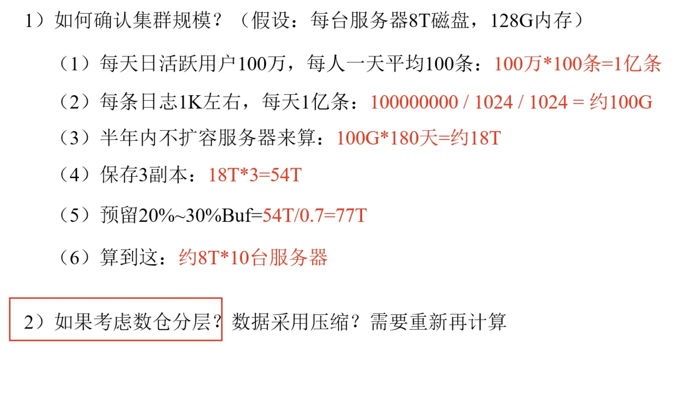
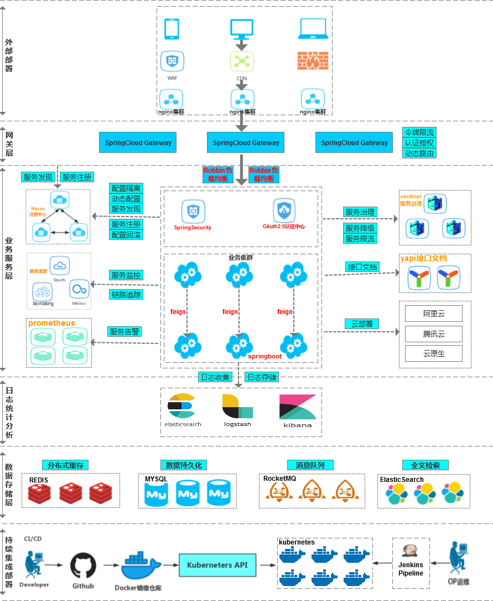
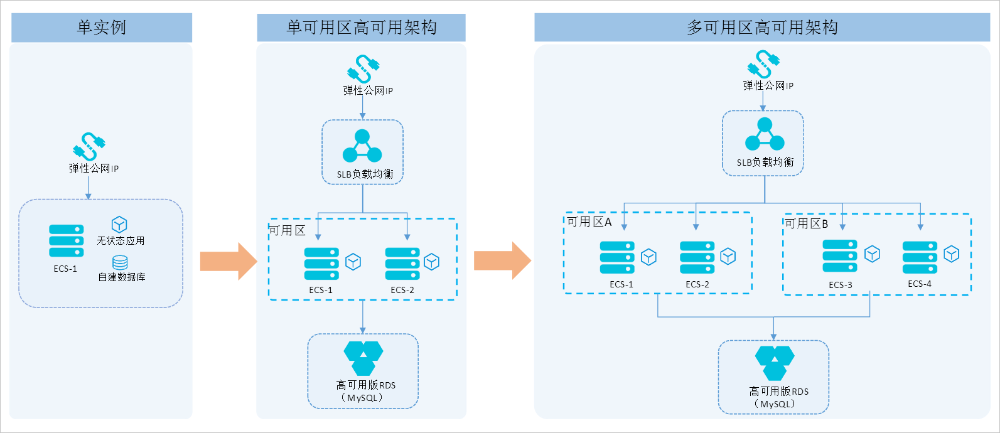
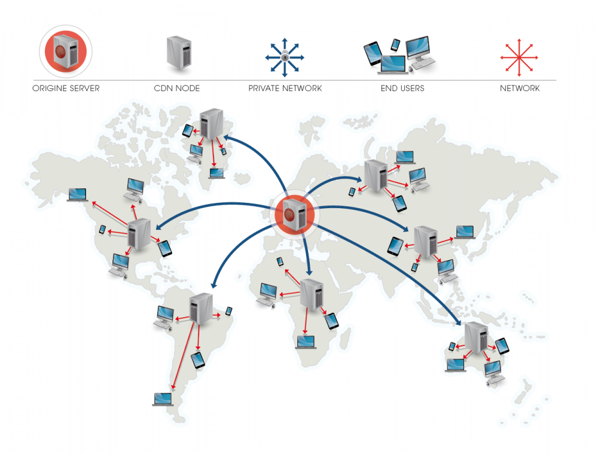
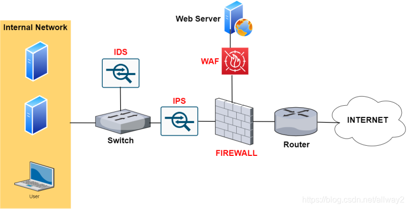
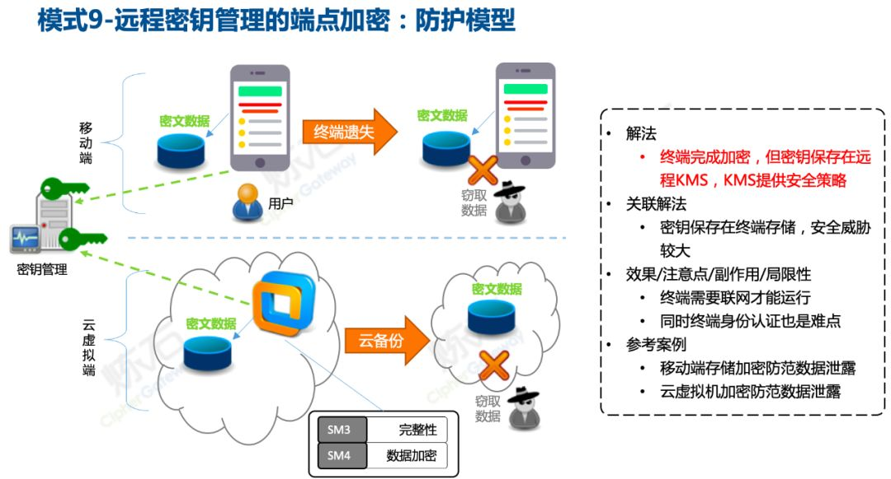

# 架构设计中的要点

架构和集群设计是系统工程中的两个关键环节，它们关系到系统的性能、稳定性、扩展性和成本。


## 需求分析(硬件上)

### 明确项目的业务需求

明确项目的业务需求，例如性能需求、数据一致性需求、可用性要求等。
了解预期的用户量、数据增长、请求量、数据读写比率等指标。

+ 业务场景对性能有什么要求?
    + 为了高性能是否可以牺牲一致性？
    + 为了一致性是否可以不要求高响应？

+ 为了满足预期需要多少集群资源？



### 集群资源规划设计

在企业中通常会搭建一套生产集群和一套测试集群。生产集群运行生产任务，测试集群 用于上线前代码编写和测试。

+ 生产集群
    + 消耗内存的分开 
    + 数据传输数据比较紧密的放在一起（Kafka 、Zookeeper）
    + 客户端尽量放在一到两台服务器上，方便外部访问 
    + 有依赖关系的尽量放到同一台服务器（例如：Hive 和 Azkaban Executor）
+ 以大数据部署为例
> 实际应用中会使用CDH这里只是举个例子

| 1       | 2       | 3     | 4     | 5     | 6  | 7  | 8     | 9     | 10    |
|---------|---------|-------|-------|-------|----|----|-------|-------|-------|
| nn      | nn      | dn    | dn    | dn    | dn | dn | dn    | dn    | dn    |
|         |         | rm    | rm    | nm    | nm | nm | nm    | nm    | nm    |
|         |         | nm    | nm    |       |    |    |       |       |       |
|         |         |       |       |       |    |    | zk    | zk    | zk    |
|         |         |       |       |       |    |    | kafka | kafka | kafka |
|         |         |       |       |       |    |    | Flume | Flume | Flume |
|         |         | Hbase | Hbase | Hbase |    |    |       |       |       |
| hive    | hive    |       |       |       |    |    |       |       |       |
| mysql   | mysql   |       |       |       |    |    |       |       |       |
| spark   | spark   |       |       |       |    |    |       |       |       |
| Azkaban | Azkaban |       |       |       | ES | ES |       |       |       |

## 模块化与分层(逻辑上)

将系统从逻辑上分解为独立的模块和层次，以便于管理和扩展。
使用服务化或微服务架构(SpringCloud)，将不同的服务职责划分明确。

+ 消息总线
+ 注册中心
+ 配置中心
+ 网关
+ 单点登录
+ 中间件
+ 数据模块
+ 业务模块
+ RestFul
+ 监控模块
+ 文件服务
+ 数据分析




## 数据设计

根据数据量、数据模型设计合适的数据库架构，选择合适的数据库类型（关系型/非关系型）。
针对数据的访问模式和一致性需求选择适合的数据复制和分片策略。

+ 需要长时间保留的、一致性高的数据可使用关系型数据库
+ 对响应要求高、查询便捷的可使用非关系型数据库
+ 如果要保存大量文档可选用mongodb之类的文档数据库
+ 如果需要对数据做分析、甚至引入机器学习则可以使用hadoop生态
+ 如果是通过REST接口提供数据，则可以使用json

以大数据业务场景为例


## 可扩展性与弹性

设计可横向扩展的架构，以对应业务增长和高峰期流量。
实现自动扩展功能，让系统能够根据负载自动增减资源。

+ 使用微服务架构
    + 使用微服务架构(SpringCloud)可以将系统分解成多个独立的服务，每个服务负责系统中的一个明确的业务功能。
+ 使用消息队列解耦应用
    + 通过使用消息队列（如Kafka、RabbitMQ）和异步处理模式，可以解耦服务并缓冲请求，这样在高峰时可以防止系统崩溃并在负载减少时平滑地减少资源。
+ 尽量使用分布式方案
    + 选择使用支持分布式和横向扩展的数据库和存储方案(如 Mysql主从、 Redis Cluster)
+ 尽量使用容器方案
    + 使用容器（如Docker）来封装应用以及其环境，然后使用容器编排工具（如Kubernetes）来自动扩展和管理这些容器。


## 高可用性与容错性

采用冗余设计，如多副本、多活跨地域集群来提高系统的可用性。
设计故障切换机制和灾难恢复策略，保证系统的持续运行。

+ 冗余设计
    + 系统的关键组件应该至少部署两个以上的副本，以此来防止单点故障（Single Point of Failure, SPOF）
    + 多区域/多可用区部署：在不同的物理位置运行服务的副本，以防止地域性灾难或网络问题导致的服务中断。
    + 负载均衡器：在服务实例之间分配流量，以便故障转移和提供统一入口。
+ 自动故障转移
    + 通过自动检测故障并将流量迁移至健康的服务实例来实现高可用性。
    + 健康检查：监控服务健康状况并在检测到异常时自动将流量切换到备用资源。
    + 自动重启/替换：部署机制在服务实例失效时启动新实例，或在硬件故障时进行替换。
+ 数据持久性和备份
    + 数据存储系统应该是高度可用和冗余的。此外，重要数据应该定期备份，并且确保可以快速恢复。
    + 复制机制：例如，使用多副本的分布式数据库系统。
    + 快照和备份：定期创建数据的快照或备份，并且在多个位置保存。
+ 灾难恢复计划
    + 建立彻底的灾难恢复计划，以便在严重故障发生时恢复操作。
    + 热备和冷备方案：实施提前配置好可快速切换的热备份系统，以及周期性测试和更新的冷备份系统。
    + 定期演练：定时进行灾难恢复演练，确保恢复步骤在真实故障发生时可以迅速有效地执行。
+ 监控和告警
    + 监控系统的运行状况，并设置告警，在出现问题时能及时通知到相关人员。
    + 综合性监控工具：监控系统的所有方面，包括硬件、网络、应用状态和性能指标。
    + 实时告警系统：在检测到问题时快速触发告警。




## 性能优化

使用高效的通信协议和数据序列化方法。
合理设置缓存层，减轻数据库层的压力。
依据性能测试结果对系统进行调优。

+ 在应用程序前端`使用CDN来缓存静态资源`，如CSS文件、JavaScript文件、图片等。
+ 在后端`使用内存缓存`（如Redis或Memcached）来存储经常访问的数据或计算密集型的结果。
+ 实现数据库查询缓存，`避免重复执行相同的查询`。
+ 妥善处理缓存失效策略，以避免缓存穿透、雪崩和击穿等问题。
+ `分析性能瓶颈`，可能是CPU、内存、IO或网络限制。
+ 考虑实施代码层面的优化，包括`算法优化`、`异步处理`、`多线程或并发编程`等。
+ 数据库层面的优化，包括合理`设计索引`、`批处理交易`、`SQL语句优化`、`使用分区表`等。
+ 对服务器和数据库进行参数调优，根据实际需要定制配置。
+ 实现自动扩展和负载均衡，确保系统可以根据负载情况动态调整资源分配。

性能优化涉及的点非常多，应用层面可以参考之前 `SpringCloud那张图`
应`多使用性能测试工具`（如Apache JMeter, LoadRunner或Locust）来模拟用户负载，并监控系统的响应。

### CDN节点提高静态资源示例




### 多线程提高性能示例


### 算法优化提高性能示例

使用平方根倒数快速算法，将多层递归牛顿迭代法计算平方根，改为一次运算求出近似解

+ 数学公式
    + 推导已省略 详情参看 https://www.bilibili.com/video/BV18j411i7bp/

$$
x = (1 + \frac{M}{2^{23}})2^{E-127}
$$

+ 雷神三源码

```c
float Q_rsqrt( float number )
{
    long i;
    float x2, y;
    const float threehalfs = 1.5F;

    x2 = number * 0.5F;
    y  = number;
    i  = * ( long * ) &y;                       // evil floating point bit level hacking
    i  = 0x5f3759df - ( i >> 1 );               // what the fuck? 
    y  = * ( float * ) &i;
    y  = y * ( threehalfs - ( x2 * y * y ) );   // 1st iteration
//  y  = y * ( threehalfs - ( x2 * y * y ) );   // 2nd iteration, this can be removed

    return y;
}
```


## 网络设计

优化网络拓扑，尽可能减少延迟和带宽限制。
根据流量模式配置合理的负载均衡策略。

+ 定期做流量分析，统计和预测各个节点之间的流量模式、流量峰值，确定业务流量特点（比如数据中心、用户访问、远程办公等）。
+ 使用高性能的核心路由器/交换机，设计一个高速、低延迟的核心网络，保障关键数据流的快速传输。
+ 使用专门的硬件负载均衡设备，根据服务器当前负载和会话的数目来分配请求。


## 安全性

实施网络层和应用层的安全策略，如防火墙、入侵检测系统等。
确保数据传输的加密和敏感数据的安全存储。

+ 防火墙部署 - 选择并部署企业级的防火墙来监控进出网络的流量。防火墙应配置为仅允许经授权的流量通过，并且应定期更新规则集。
+ 入侵检测和预防系统 (IDS/IPS) - 实施入侵检测系统（IDS）或入侵预防系统（IPS）以监控异常网络行为或攻击模式，并在检测到潜在威胁时提供警报或自动响应。
+ 虚拟私人网络 (VPN) - 提供 VPN 服务以确保员工和系统之间的远程通信得到加密和保护。
+ 网络分段 - 对网络资源进行分段，以减少攻击面和限制潜在的安全威胁。通过 VLAN 或隔离网络实施分段。
+ 安全编码实践 - 在开发过程中遵循安全编码标准，以减少软件中的安全漏洞。
+ 使用标准加密算法 - 使用经过验证的加密算法如 AES、RSA、TLS 等来加密敏感数据。






## 监控和日志

实施实时监控系统，以获取系统的健康状态和性能指标。
收集和分析日志，便于故障排查和性能调优。

### 定义监控目标和日志策略
+ 确定监控目标
    + 系统性能（CPU 使用率、内存使用、磁盘 I/O、网络吞吐量等）
    + 服务健康（服务可用性、响应时间、错误率等）
    + 业务指标（用户活跃度、交易量、流程完成率等）
+ 确定日志级别和内容
    + 错误日志（系统错误、异常）
    + 警告日志（非致命问题，可能需要注意）
    + 信息日志（系统操作信息，如用户登录登出）
    + 调试日志（调试信息，通常在开发或故障排查时使用）
+ 监控工具
    + Prometheus + Grafana（开源，适用于指标收集和可视化）
    + Zabbix（开源）


## 成本效益

评估与预算项目的成本，并根据需要在性能和成本之间权衡。
考虑使用云服务能带来的经济效益，如按需付费等。

## 灵活性与未来证明

架构设计应有助于未来技术的整合，避免落入技术陷阱。
考虑系统未来可能的扩展方向，如新功能的添加和技术栈的迭代。

